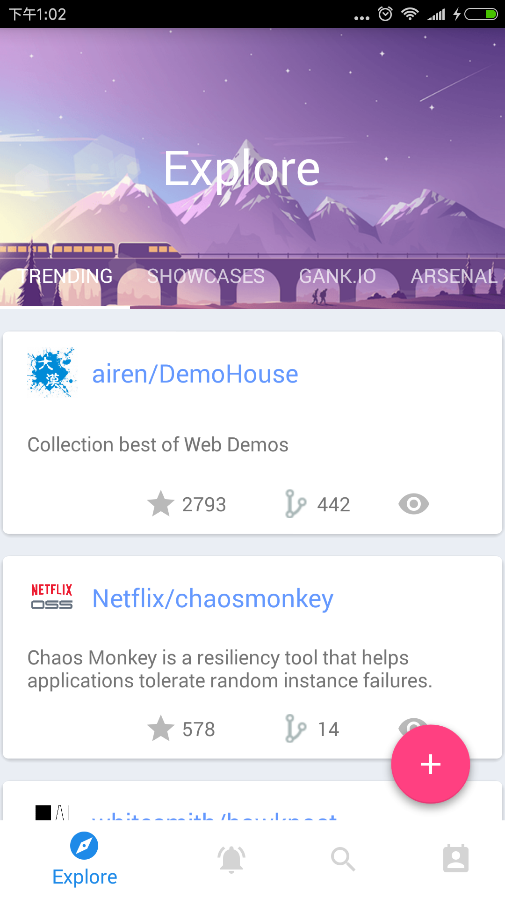
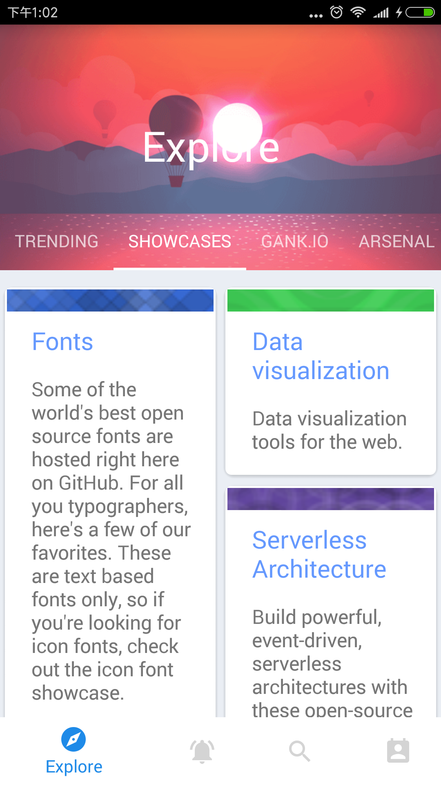
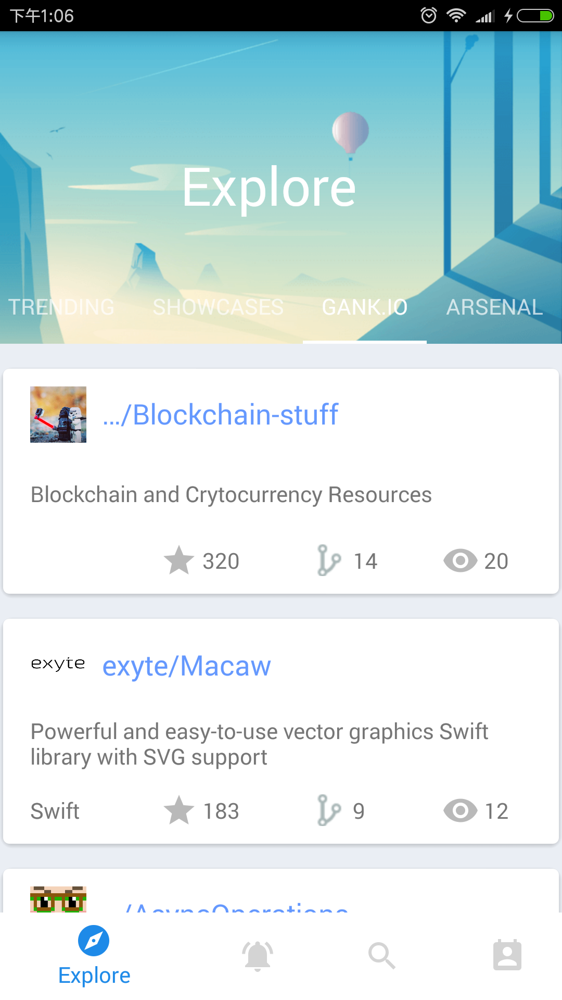
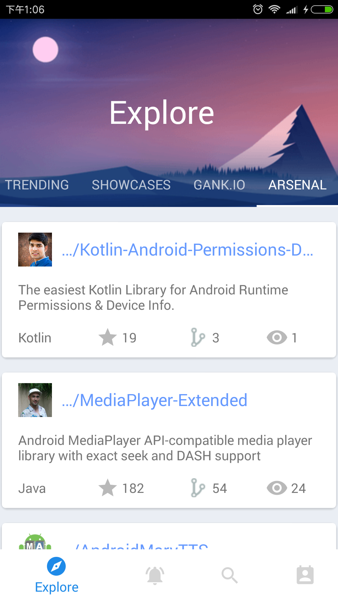
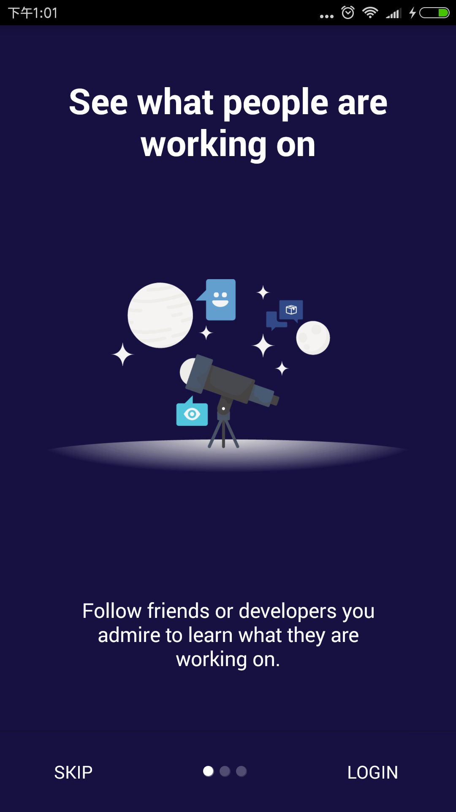
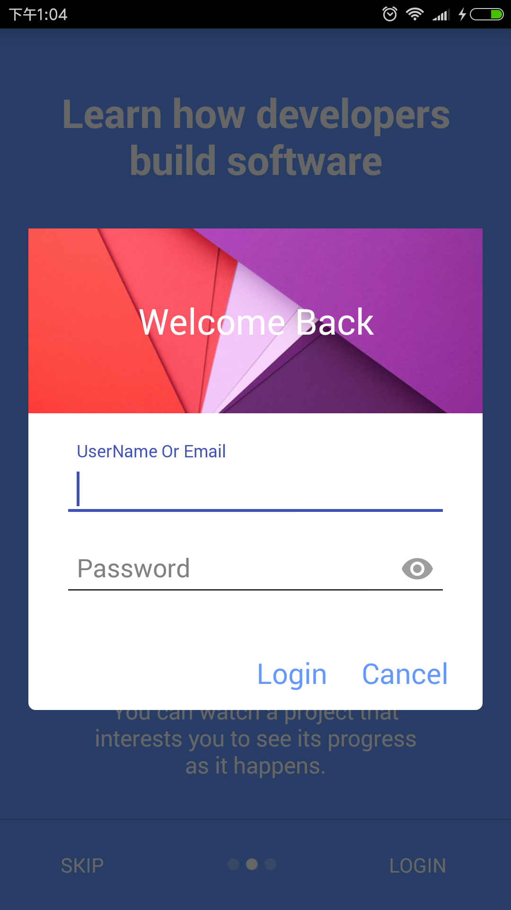
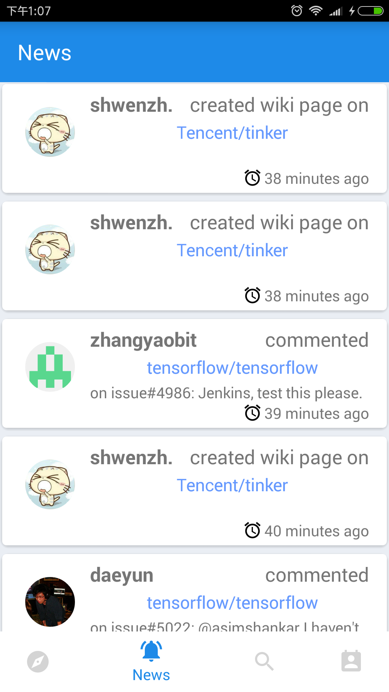
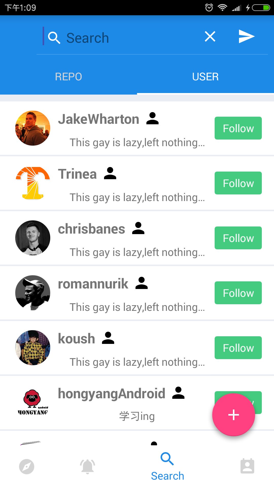
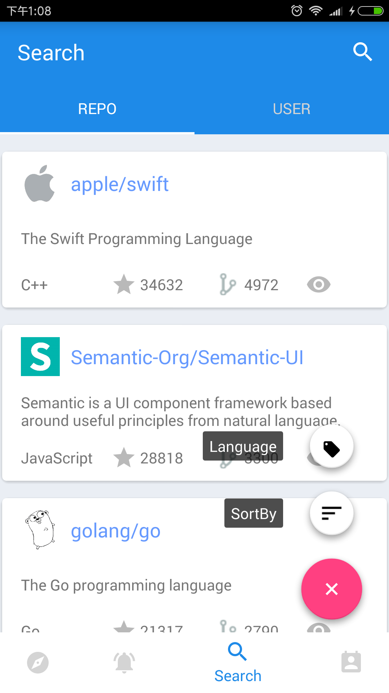
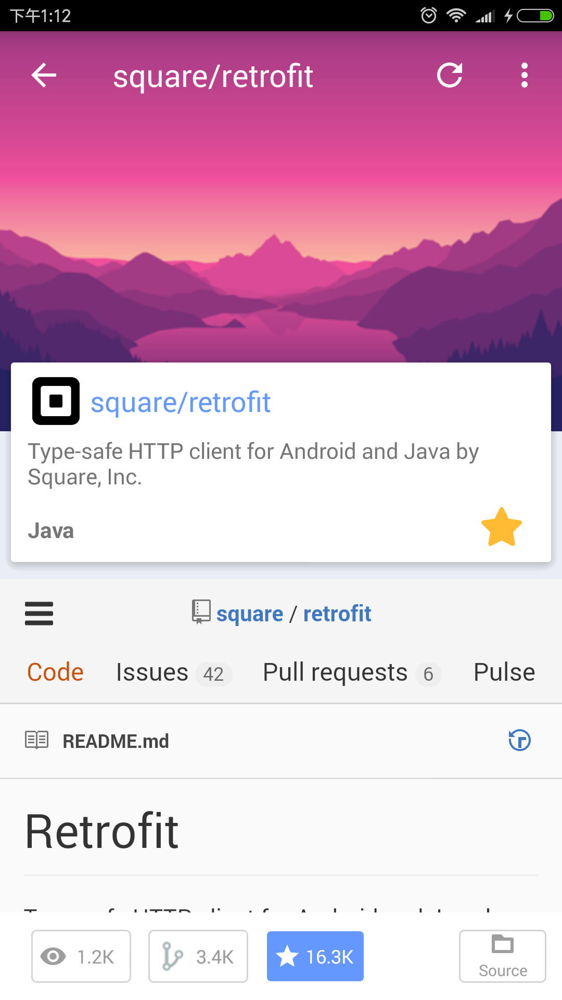

# GitClub

*An elegent Android Client for Github.*  
[Apk is available in Github.](https://github.com/TellH/GitClub/raw/dev/apk/app-release.apk)  
This material design style App is built with dagger2+Retrofit+RxJava and MVP architecture. 
Why I create this app?

1. I love Github very much.
2. I want to discover some remarkabe projects or something new in Github with my phone in my spare time especially when I don't have computer nearby.
3. I want to combine some fashionable frameworks to build an entire Android app in good practice.

---------------

## Feature

1. Clean and material design style UI.
2. In `Explore` tab, you can discover plenty of excellent Github repositories in [Trending](https://github.com/trending), [Showcases](https://github.com/showcases), [Gank.io(干货集中营)](http://gank.io/) and [Android Arsenal](http://android-arsenal.com/). 
3. In `Search` tab, the app lists ranking repositories and users by language, stars or followers.
4. In repostiroy source code Activity, the app will display the source tree of the repository just like the [octotree](https://github.com/buunguyen/octotree)(a chrome plugin).
5. Explore in the app : )

## Screenshots

## Thanks

- [dagger2](https://github.com/google/dagger)
- [RxJava](https://github.com/ReactiveX/RxJava)
- [Logger](https://github.com/orhanobut/logger)
- [OkHttp](https://github.com/square/okhttp)
- [Retrofit](https://github.com/square/retrofit)
- [Stetho](https://github.com/facebook/stetho)
- [Gson](https://github.com/google/gson)
- [picasso](https://github.com/square/picasso)
- [leakcanary](https://github.com/square/leakcanary)
- [material-dialogs](https://github.com/afollestad/material-dialogs/)
- [ahbottomnavigation](https://github.com/aurelhubert/ahbottomnavigation/)
- [floatingactionbutton](https://github.com/futuresimple/android-floating-action-button)
- [AppIntro](https://github.com/PaoloRotolo/AppIntro)
- [ShineButton](https://github.com/ChadCSong/ShineButton)
- [GithubApp](https://github.com/mingjunli/GithubApp)
- 友盟社会化分享
- [RecyclerTreeView](https://github.com/TellH/RecyclerTreeView)
- [NoListAdapter](https://github.com/TellH/NoListAdapter)

Thanks Github,  [Gank.io(干货集中营)](http://gank.io/) and [Android Arsenal](http://android-arsenal.com/).

## TODO

- 夜间模式
- 国际化

## License
   Copyright 2016 TellH

   Licensed under the Apache License, Version 2.0 (the "License");
   you may not use this file except in compliance with the License.
   You may obtain a copy of the License at

       http://www.apache.org/licenses/LICENSE-2.0

   Unless required by applicable law or agreed to in writing, software
   distributed under the License is distributed on an "AS IS" BASIS,
   WITHOUT WARRANTIES OR CONDITIONS OF ANY KIND, either express or implied.
   See the License for the specific language governing permissions and
   limitations under the License.

